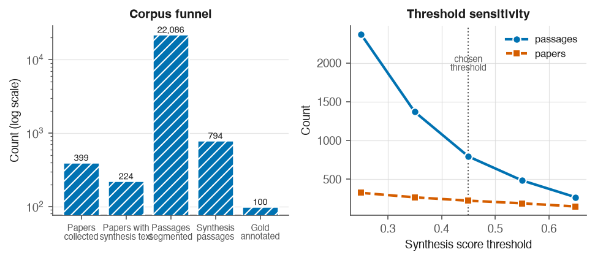

# 3. Methodology

## 3.1 Ontology

The extraction target is defined by a MOF-specific ontology (v0.2) held in
`configs/ontology.json`, which is the single source of truth for the type system. Nine
entity types are defined: MOF, MetalPrecursor, OrganicLinker, Solvent, SynthesisMethod,
Condition, Property, Application and Paper. Nine relations connect them:

| Relation | From | To |
|---|---|---|
| USES_PRECURSOR | MOF | MetalPrecursor |
| USES_LINKER | MOF | OrganicLinker |
| SYNTHESIZED_BY | MOF | SynthesisMethod |
| IN_SOLVENT | SynthesisMethod | Solvent |
| AT_CONDITION | SynthesisMethod | Condition |
| HAS_PROPERTY | MOF | Property |
| MEASURED_AT | Property | Condition |
| USED_IN | MOF | Application |
| MENTIONED_IN | any | Paper |

Two design decisions in this table matter later. Solvents and conditions attach to a
synthesis method rather than directly to the MOF, so the method acts as a connector; this is
what makes the object of those relations the substantive claim. And MENTIONED_IN is never
produced by an extractor: it is attached by the pipeline from passage metadata, so that
provenance cannot be hallucinated.

The type literals in the extraction interface are checked against the ontology file by
automated tests, so the two cannot drift apart silently.

## 3.2 Corpus

Papers were collected from the Europe PMC open-access subset, which exposes structured JATS
full text with labelled sections. This was preferred over publisher scraping and PDF parsing
because section labels are given rather than inferred, which the segmentation step depends on.

The query was `(metal-organic framework AND synthesis) AND OPEN_ACCESS:y AND HAS_FT:y AND
IN_EPMC:y`. The collected corpus is **399 papers and 20,582,200 characters**, every one
carrying a DOI. Licences are 299 CC BY, 56 CC BY-NC-ND, 43 CC BY-NC and 2 unrecognised, the
last of which are excluded from redistribution pending verification.

Publisher distribution by DOI prefix is RSC 107, MDPI 78, ACS 75, Nature 40, Wiley 40,
Elsevier 11 and a long tail. This matters for RQ3: RSC, ACS and Wiley are the publishers
DigiMOF drew from, so an open-access Europe PMC corpus does overlap the reference database's
source population.

One paper was returned twice by the search API across cursor pages. Deduplication by PMCID
and DOI is applied at collection, because passage identifiers are derived deterministically
from the paper identifier and a duplicate paper would otherwise produce colliding passage
identifiers in the gold standard.

## 3.3 Segmentation

The unit of extraction is the synthesis paragraph, not the paper. Papers run 20,000 to
50,000 characters and most of that text contains no recipe, so passing whole papers to an
extractor would be both expensive and noisy.

Sections are split into paragraphs with character offsets preserved, short fragments merged
into neighbours and long paragraphs split. Each passage receives a stable, deterministic
identifier derived from the paper identifier, section name, section occurrence and index, so
that the gold standard's references survive a corpus rebuild.

Each passage is scored for synthesis content by a transparent weighted rule set whose
weights are module-level constants and sum to 1.0, with saturation caps so that one repeated
word cannot carry a passage. The signals are section-title cues, method words, quantity and
unit patterns, apparatus terms, MOF solvents and procedure verbs. A learned filter was
rejected deliberately: it would need labelled data that this project spends on the gold
standard instead, and its decisions could not be recomputed by a reader.

Segmentation produces **22,086 passages**, of which **794 across 224 papers** are flagged as
synthesis at the chosen threshold of 0.45, with a mean length of 931 characters.

The threshold is a declared choice, not an accident. Its sensitivity is:

| Cutoff | Passages | Papers |
|---|---|---|
| 0.25 | 2,369 | 325 |
| 0.35 | 1,369 | 267 |
| **0.45** | **794** | **224** |
| 0.55 | 485 | 190 |
| 0.65 | 268 | 149 |

**Figure 1.** Left, the corpus funnel from collection to the gold standard, on a log scale
because each stage is roughly an order of magnitude smaller than the last. Right, the same
threshold sensitivity as the table, shown as a curve so the chosen cutoff of 0.45 can be seen
sitting on the shoulder of the curve rather than at an arbitrary point on a steep slope.

## 3.4 Gold standard

**Provenance of the annotations.** The gold standard is the instrument against which the
language models are measured, so it was produced by the author by hand. Pre-filling it with
model output, even from a model not under test, would make the evaluation circular and is
the single shortcut this project could not take.

**Sampling.** The worklist is 100 passages drawn with a fixed seed: 90 from the
synthesis-flagged pool and **10 control passages that the pre-filter did not flag**. The
control stratum exists so that the pre-filter's own miss rate is measurable; without it,
every recall figure reported here would be silently conditional on an unvalidated heuristic.
The two strata are interleaved rather than blocked so that annotator fatigue does not fall
entirely on one of them.

The sample size was reduced from the 150 to 200 stated in the exposé, on 2026-08-31, because
annotator hours are the binding constraint and the submission date is fixed. The cost is
precision, reported as wider confidence intervals and reduced support for rare relations.
The stratification, the seed and the control stratum were preserved, because those are what
make the evaluation reproducible.

**Tooling.** Annotation used a purpose-built interface in which the relation is chosen first
and the subject and object types are then constrained to that relation's legal endpoints, so
an ontology-invalid triple cannot be created. Work is autosaved after every action.

**Result.** 100 records containing **138 triples**. 32 passages contain synthesis records and
68 do not. Per-relation support is:

| Relation | Support |
|---|---|
| USES_PRECURSOR | 39 |
| IN_SOLVENT | 34 |
| AT_CONDITION | 34 |
| USES_LINKER | 30 |
| SYNTHESIZED_BY | 1 |
| HAS_PROPERTY, MEASURED_AT, USED_IN | 0 |

Only the first four relations carry enough support to support a conclusion. The scarcity of
the others is itself a finding about where information sits in a paper: properties and
applications are rarely stated inside a synthesis paragraph.

## 3.5 Extractors

All extractors implement one interface and return the same triple shape, so that every
strategy is evaluated on identical terms. The interface forbids raising: a failure is
recorded in the result rather than aborting a batch.

**Rule-based baseline.** A dictionary and regular-expression system whose vocabulary is
derived from the MOF-adapted ChemDataExtractor parsers used to build DigiMOF and from
inspection of the corpus. It was built to work rather than to lose, because a weak baseline
would make every reported improvement meaningless. It attempts implicit synthesis routes
rather than skipping them, emitting an inferred route at low confidence with a null span so
that explicit and inferred routes can be scored separately.

**Language models.** Four prompting strategies (zero-shot, few-shot, schema-guided,
chain-of-thought) are defined as versioned template files rather than inline strings, so the
template version forms part of the response cache key. Each template states the allowed
entity and relation types with their endpoint constraints and forbids inventing values not
present in the passage. Responses are parsed defensively: triples with invalid relation
types or endpoint violations are dropped with the reason recorded rather than admitted.

**Models.** gpt-4o and gpt-4o-mini as the commercial strand, and qwen3.8-27b served on a
free tier as the open-weight strand. The exposé named Llama-3; that model is no longer hosted
by the provider used here, which is recorded in Chapter 7 as a deviation.

## 3.6 Evaluation design

Matching is per (passage, relation) group with greedy one-to-one assignment, so no prediction
can be credited outside its own passage and no gold triple can be matched twice. Scoring is
binary: a pair counts as a true positive or it does not.

Two matching modes are implemented, exact and relaxed, both built on a single shared
normaliser that is also used by the graph loader, so that the evaluation and the artefact
cannot disagree about whether two names denote the same chemical. The normaliser resolves
documented synonyms, drops hydrate notation, unifies unit spelling without converting
magnitudes, and deliberately keeps UiO-66 distinct from UiO-67.

**One concession is declared.** IN_SOLVENT and AT_CONDITION are scored on the object alone.
The annotation tool contained a defect in which a text field retained its previous value when
the relation changed, so every gold triple of these two types records the MOF's name in the
subject position where the synthesis method belongs. Scoring those subjects literally would
mark a model wrong for correctly answering "solvothermal". The concession is independently
justified by the ontology, in which the subject of these relations is a connector rather than
a claim, and it is carried on every evaluation result so that a generated table states it.
What it costs is that this study cannot show whether a model attaches a solvent to the correct
synthesis when a passage describes several.
