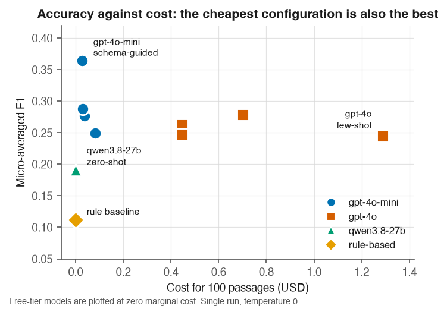
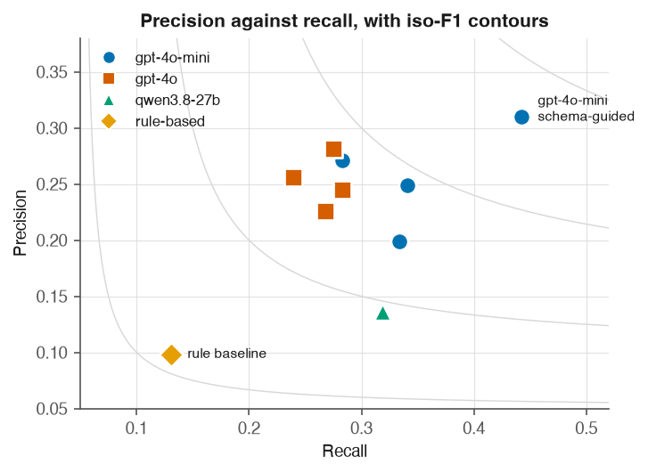
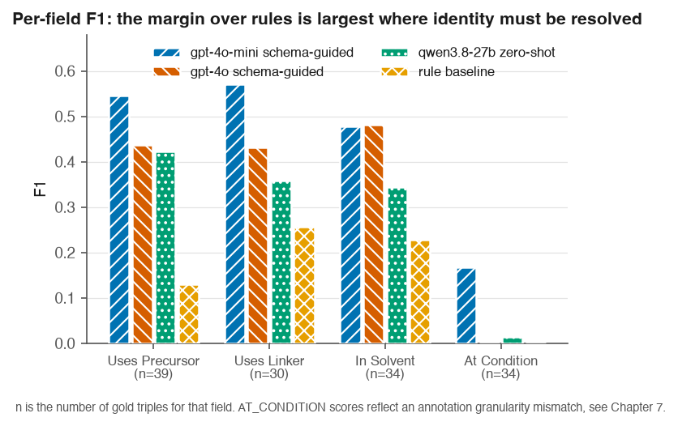
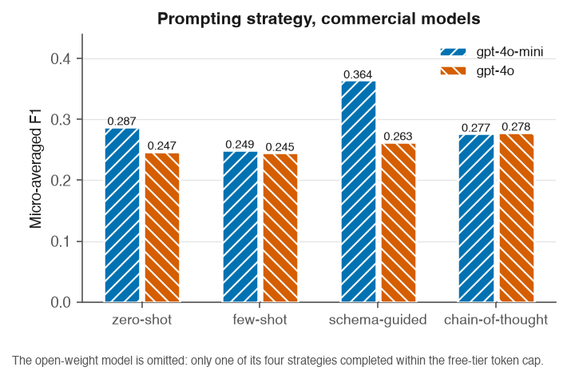

# 5. Results

All figures below were produced by the pipeline in this repository and can be regenerated
with `bash scripts/run_experiments.sh` followed by
`python -m src.evaluation.run_eval --mode relaxed`. Ten extractor configurations were run
over 100 gold passages containing 138 annotated triples, for a total API spend of 3.06 USD.
Every configuration reported here covers all 100 passages; two were removed rather than
reported from partial data, as described in Section 5.6.

## 5.1 The pre-registered prediction

Before any language model was run, the following prediction was recorded in
`docs/baseline_findings.md`, on the basis that conditions and solvents are matched by local
surface patterns that rules already handle well, whereas identifying which material is being
made is not:

> The LLM margin over the rule baseline should be largest on USES_PRECURSOR and USES_LINKER,
> and smallest on AT_CONDITION and IN_SOLVENT.

Measured, comparing the best language-model configuration with the rule baseline:

| Field | Rule baseline F1 | Best LLM F1 | Margin | Predicted rank |
|---|---|---|---|---|
| USES_PRECURSOR | 0.13 | 0.55 | +0.42 | largest, confirmed |
| USES_LINKER | 0.26 | 0.57 | +0.31 | large, confirmed |
| IN_SOLVENT | 0.23 | 0.48 | +0.25 | smaller, confirmed |
| AT_CONDITION | 0.00 | 0.17 | +0.17 | smallest, confirmed |

The ordering matches the prediction exactly. Because the prediction was committed to the
repository before the models were run, this is a confirmation rather than a pattern
identified after the fact.

## 5.2 Overall performance

Relaxed matching, micro-averaged over all scored relations:

| Extractor | Precision | Recall | F1 | Cost (USD) | Mean latency |
|---|---|---|---|---|---|
| gpt-4o-mini schema-guided | 0.310 | 0.442 | **0.364** | 0.028 | 3.3 s |
| gpt-4o-mini zero-shot | 0.249 | 0.341 | 0.287 | 0.030 | 3.8 s |
| gpt-4o chain-of-thought | 0.281 | 0.275 | 0.278 | 0.701 | 5.8 s |
| gpt-4o-mini chain-of-thought | 0.271 | 0.283 | 0.277 | 0.037 | 5.2 s |
| gpt-4o schema-guided | 0.245 | 0.283 | 0.263 | 0.446 | 6.5 s |
| gpt-4o-mini few-shot | 0.199 | 0.333 | 0.249 | 0.083 | 4.5 s |
| gpt-4o zero-shot | 0.256 | 0.239 | 0.247 | 0.447 | 3.2 s |
| gpt-4o few-shot | 0.226 | 0.268 | 0.245 | 1.289 | 8.0 s |
| qwen3.8-27b zero-shot (open weight) | 0.136 | 0.319 | 0.191 | 0.000 | 13.2 s |
| rule-based baseline | 0.098 | 0.130 | 0.112 | 0.000 | 0.001 s |

Every language-model configuration outperforms the rule-based baseline. The weakest language
model configuration scores 0.191 against the baseline's 0.112.

**Figure 1.** Accuracy against cost. The relationship is the finding: the strongest
configuration sits at the far left, and the most expensive configuration scores lower than
one costing a forty-seventh as much. Free-tier models are plotted at zero marginal cost.
Marker shape encodes model family in addition to colour, so the figure survives greyscale
reproduction.

F1 collapses precision and recall into one number, which hides whether a configuration is
cautious or scattergun. Plotting the two axes separately against iso-F1 contours makes that
visible:

**Figure 4.** Precision against recall. Every language-model configuration sits above and to
the right of the rule baseline on both axes, not only on the combined score. Recall varies
more across the ten configurations than precision does, which is the more actionable
observation for anyone tuning a prompt: the strategies mostly differ in how much they find,
less in how often what they find is right.

## 5.3 Per-field results (RQ1)

For the strongest configuration, gpt-4o-mini with schema-guided prompting:

| Field | P | R | F1 | TP | FP | FN | Support |
|---|---|---|---|---|---|---|---|
| USES_LINKER | 0.615 | 0.533 | 0.571 | 16 | 10 | 14 | 30 |
| USES_PRECURSOR | 0.553 | 0.538 | 0.545 | 21 | 17 | 18 | 39 |
| IN_SOLVENT | 0.485 | 0.471 | 0.478 | 16 | 17 | 18 | 34 |
| AT_CONDITION | 0.140 | 0.206 | 0.167 | 7 | 43 | 27 | 34 |

Support counts are printed beside every score deliberately. SYNTHESIZED_BY has a support of
1 and HAS_PROPERTY, MEASURED_AT and USED_IN have a support of 0, so no conclusion is drawn
about them; where a model emits triples for those relations they appear only as false
positives, which is why HAS_PROPERTY shows 21 false positives against zero support.

Excluding AT_CONDITION, whose behaviour is explained in Section 5.5, the best configuration
averages approximately 0.53 across the three remaining fields.

**Figure 2.** Per-field F1 for four representative configurations, with the number of gold
triples printed on each axis label. Support is shown in the figure rather than only in the
caption so that fields backed by different amounts of evidence are not compared silently.

## 5.4 Prompting strategies (RQ2) and open weight against commercial (RQ4)

**Prompting strategies**, commercial models, all four strategies complete:

| Model | zero-shot | few-shot | schema-guided | chain-of-thought |
|---|---|---|---|---|
| gpt-4o-mini | 0.287 | 0.249 | **0.364** | 0.277 |
| gpt-4o | 0.247 | 0.245 | 0.263 | **0.278** |

Schema-guided prompting wins clearly on the stronger configuration, supporting the premise
that constraining output to the ontology helps. It does not win universally: on gpt-4o,
chain-of-thought leads by 0.015, a margin a 138-triple gold standard cannot resolve. The
defensible claim is that schema-guided is the best single choice observed, not that it
dominates.

Few-shot is the weakest strategy on both models despite having by far the most expensive
prompt, 4,054 template tokens against 652 for schema-guided. The worked examples cost
roughly six times more per call and bought nothing measurable here.

**Figure 3.** Prompting strategy by model. Only the two commercial models appear: just one of
the open-weight model's four strategies completed within the free-tier token cap, and placing
a single point beside two complete sets would invite a comparison the data cannot support.

**Open weight against commercial**, compared like for like on zero-shot, the one strategy
where all three models have complete coverage, so that model and strategy are not confounded:

| Model | F1 | Cost (USD) | Mean latency |
|---|---|---|---|
| gpt-4o-mini (commercial) | 0.287 | 0.030 | 3.8 s |
| gpt-4o (commercial) | 0.247 | 0.447 | 3.2 s |
| qwen3.8-27b (open weight) | 0.191 | 0.000 | 13.2 s |
| rule-based baseline | 0.112 | 0.000 | 0.001 s |

The ordering is commercial, then open weight, then rules. The open-weight model reaches
approximately two thirds of the best commercial F1 at zero marginal cost and roughly four
times the latency, the latter being a property of the free serving tier rather than of the
model.

**The cheaper commercial model outperforms the more expensive one.** gpt-4o-mini beats
gpt-4o on three of four prompting strategies. The strongest configuration overall costs
0.028 USD; the most expensive configuration, gpt-4o few-shot, costs 1.289 USD and scores
lower, a 47-fold cost difference in favour of the weaker model. Chapter 6 discusses the
likely mechanism.

## 5.5 Knowledge graph (RQ5)

Loading the rule-based extractions over all 794 synthesis passages produced a graph of
**485 distinct nodes and 2,429 relationships across 182 papers**, from 1,864 triples with
zero skipped and zero load errors. Entity resolution collapses 3,728 node merge operations
into 485 distinct nodes.

**Provenance is verified rather than asserted.** The `provenance_violations` query, which
returns any entity lacking a MENTIONED_IN edge to a source paper, returns zero rows.

Cross-paper aggregation over synthesis methods:

| Method | Papers | MOFs |
|---|---|---|
| solvothermal | 61 | 30 |
| hydrothermal | 43 | 12 |
| electrochemical | 36 | 6 |
| microwave-assisted | 36 | 6 |
| stirred at room temperature | 35 | 5 |
| reflux | 21 | 3 |

DigiMOF reported more hydrothermal (5,677) than solvothermal (3,672) records and described
that ordering as surprising, since solvothermal is the more common laboratory route. This
corpus shows the opposite ordering. The difference may reflect corpus composition, an
open-access Europe PMC set against a CSD-derived one, or a difference in how each system
infers an unnamed route. It is recorded here as an open question rather than resolved.

## 5.6 What is not reported, and why

Three of four open-weight prompting strategies could not be completed. The free serving tier
caps this model at 200,000 tokens per day and 8,000 per minute. The per-minute throttle is
handled by retrying on the provider's stated delay; the daily cap is a hard stop.
Schema-guided completed 26 of 100 passages before exhaustion and few-shot completed 3 of 100.

Both were deleted from the results rather than scored. A configuration answering 26 of 100
passages is still scored against all 138 gold triples and reports an artificially low recall,
which would misrepresent a rate-limited model as a weak one. Reporting a strategy as not
obtained is honest; reporting it as scoring near zero is not.

RQ4 therefore rests on a single prompting strategy for the open-weight side.
