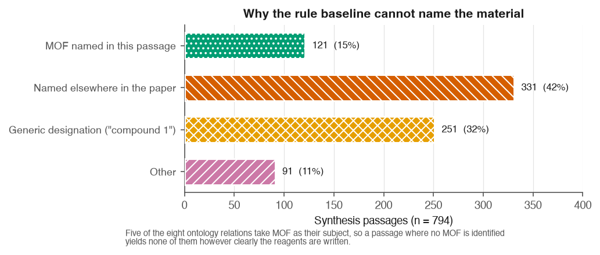

# 6. Discussion

I want to use this chapter to actually think through the results in Chapter 5, rather than
restate them with different wording. Three questions seem worth answering properly: what the
pre-registered prediction actually tells me, why the cheaper model beat the more expensive
one, and what the rule baseline's weak MOF-identification rate says about maintaining a
system like it. I will end by coming back to the gap I set out in Chapter 2 and being honest
about how much of it this project actually closes.

## 6.1 What the pre-registered prediction confirms, and what it does not

I recorded a prediction before running a single model: the margin over the rule baseline
should be largest on USES_PRECURSOR and USES_LINKER, and smallest on AT_CONDITION and
IN_SOLVENT. The reasoning was that naming the material scattered across a passage takes
something closer to reading comprehension, while matching a condition or a solvent is closer
to pattern spotting. The measured ordering matched that exactly (Section 5.1), and I think
it is fair to call that a real confirmation, not a pattern I noticed after the fact and then
described as expected.

I still want to be careful about what it establishes. It tells me *where* the gap between
rules and language models is largest, and the reasoning I used to predict that turned out to
point the right way. It does not tell me *why* in any mechanistic sense. I never looked at
what happens inside the model, only at what came out the other end, so a prediction holding
up is evidence the reasoning is *consistent* with the result, not proof that the reasoning is
the actual explanation.

Sitting with the numbers a bit longer, I think the result also sharpens something the DigiMOF
authors said rather than just testing it. They wrote that implicit synthesis routes, ones a
paper implies through solvent and temperature instead of naming outright, are "challenging to
extract using rule-based NLP" (Glasby et al., 2023), which is a claim about *inferring a
method*. What I found is a step earlier and, honestly, more basic: the rule baseline's
biggest problem is not inferring the method, it is knowing which MOF the passage is even
about in the first place (Section 6.3). I do not think these two findings contradict each
other. A system that cannot name the product of a synthesis has little chance of correctly
inferring its method from indirect cues either, since five of the eight relations in this
ontology, and probably DigiMOF's extraction logic too, hang off the MOF node. I tested the
prediction relation by relation, but the MOF-identification finding is, I think, a good part
of the reason the rule baseline's disadvantage shows up everywhere rather than only on the
fields that need inference.

## 6.2 Why the cheaper model outperformed the more expensive one

This is the finding I am least able to fully explain, and also the one I think matters most
practically. gpt-4o-mini beat gpt-4o on three of the four prompting strategies, at roughly a
forty-seven-fold difference in cost. Before I try to explain it, two things about how I
measured it matter.

First, F1 against a fixed gold standard punishes a missed triple and a wrong triple the same
way. A model that reports more candidate triples per passage does not automatically gain
recall from that, and it will lose precision if a meaningful share of those extra triples are
wrong. Second, looking at the per-field breakdown in Section 5.3, gpt-4o-mini's advantage
sits mostly in USES_PRECURSOR and USES_LINKER, which happen to be the two fields with the
most gold support (39 and 30 triples) and the two where the rule baseline already trailed the
most. That is exactly where the two commercial models had the most room in the data to be
told apart.

My best guess, and I want to be clear it is a guess rather than something I have verified, is
that gpt-4o's answers are simply more elaborate. It seems to surface more candidate entities
per passage, including plausible-sounding ones that were not actually part of the specific
synthesis being described, a reagent mentioned in passing rather than one used in the recipe.
Against a strict matcher and a gold standard of only 138 triples, that kind of verbosity turns
into false positives rather than extra correct answers. That story is consistent with the
precision figures in Section 5.2, where gpt-4o's precision is not obviously better than
gpt-4o-mini's despite doing better on most general benchmarks, but consistency is not the same
as confirmation. I have listed a manual error review, actually reading the false positives
from both models side by side, as the next concrete step in Chapter 8, because that is the
only way I can think of to test this properly rather than just gesture at it. Until that is
done, the honest claim is the narrower one already in Chapter 5: the cheaper model wins on
this evaluation at this cost, and the reason why is a hypothesis, not a result.

There is a plainer possible explanation too, and I do not want to quietly favour the more
interesting story over it. gpt-4o-mini might just be better suited to a concise,
schema-constrained extraction task, independent of any verbosity effect at all. Either way,
the practical takeaway is the same. Whatever a model's reputation on general benchmarks, it
did not predict how it would do on this specific task, and if this study had only tested the
larger flagship model of each vendor, on the assumption that bigger is safer, it would have
reached the wrong conclusion for no better reason than not having checked.

## 6.3 What the 15 percent MOF-identification rate means for rule-based pipeline maintainers

The rule baseline names a MOF in only 121 of the 794 synthesis passages in the full corpus,
about 15 percent (Section 8.3; reproducible with
`python -m src.pipeline --extractors rule_based --no-resume`). Figure 6 shows where the other
673 passages go. 331 name the MOF somewhere else in the paper, usually at first mention
rather than in the synthesis paragraph itself, and 251 use a generic label like "compound 1"
that only resolves to an actual chemical identity through a table or a cross-reference the
passage itself does not contain. The remaining 91 are cases such as a name coined by the
authors that no fixed dictionary could have anticipated.

**Figure 6.** The rule baseline's dominant failure is not a missing dictionary entry.
Coreference across a paper and generic numbered designations together account for more than
four times as many passages as successful MOF identification.

Neither of the two big causes is a lexicon gap. You can always grow a vocabulary, and
DigiMOF's own parsers are already extensive, but no amount of vocabulary helps when the
information the parser needs simply is not in the passage it is looking at. If I were
maintaining or extending a rule-based pipeline over this kind of literature, I do not think
I would reach for a bigger dictionary first. I would reach for coreference resolution across
a paper, so a synthesis paragraph can be linked back to the name the compound was given when
it was first introduced, and for table parsing, since a numbered designation is very often
defined in a table that the running text never repeats. Both are engineering problems a
rule-based system can solve without becoming a language model, and honestly both look more
tractable to me than the implicit-route inference problem Glasby et al. (2023) describe,
because neither requires inference. They just require linking two places in the same document
that already state the fact plainly.

I read this as reframing rather than overturning the claim I set out to test in Chapter 2.
Implicit method inference is a real difficulty for rule-based extraction, and the smaller LLM
margins I measured on IN_SOLVENT and AT_CONDITION are consistent with rules already handling
the easier, locally-patterned end of that spectrum reasonably well. But for MOF synthesis
specifically, the bigger and more basic obstacle sits earlier in the pipeline, at working out
which compound is even being discussed, and that is why the language model's advantage over
rules in this study turned out larger on those identity-dependent fields than the original
framing led me to expect.

## 6.4 What this means for building such a pipeline today

Two choices in this project were made for cost reasons, not as a deliberate research design,
and both turned out to also be the ones the results actually support. Schema-guided
prompting, the cheapest template I tested at 652 tokens against 4,054 for few-shot, was also
the best-performing strategy on the strongest model. And the free-tier open-weight model, at
zero marginal cost, reached about two thirds of the best commercial F1. Put together with the
cheaper-model result in Section 6.2, the shape of this whole evaluation is that the most
expensive choices I tested, few-shot prompting and the larger commercial model, were beaten by
cheaper alternatives on every axis I measured. I do not think that means an expensive
configuration is never worth it. It means that for this task, on this gold standard, it was
not, and anyone building something similar on a tight budget now has an actual measurement to
start from instead of an assumption.

The absolute numbers are still modest, and I do not want to end this chapter sounding more
confident than they warrant. Chapter 7 sets out why 0.364 micro-F1, or roughly 0.53 once the
field whose scores measure annotation granularity rather than extraction quality is excluded,
is a lower bound rather than a ceiling, and what it would actually take to close the remaining
gap to the target I set in the exposé.
